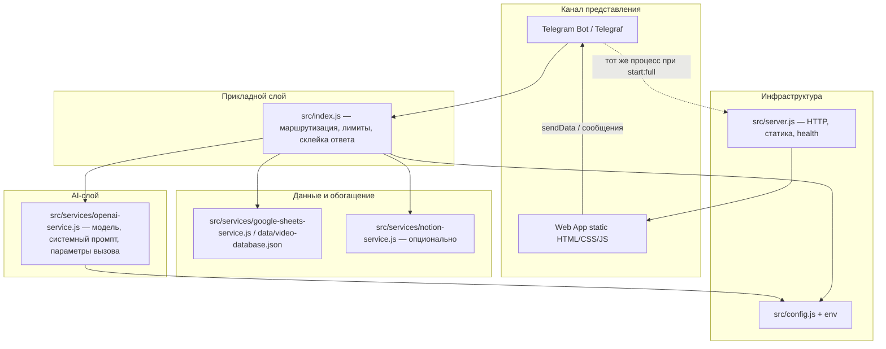

# Архитектура приложения (слои и AI)

Документ выстроен в духе распространённых практик для **продуктов с LLM**: явные границы, предсказуемые контракты данных, один источник правды для промптов и конфигурации модели, отделение каналов доставки от «мозга» генерации.

---

## 1. Контекст продукта (bounded context)

- **Назначение:** персональная **недельная программа тренировок** по запросу пользователя (текст или форма Mini App).
- **Каналы:** Telegram (бот + Web App), в перспективе — только расширение этого же домена (тот же сценарий «запрос → программа»).

---

## 2. Слои (layered architecture)

| Слой | Файлы / модули | Ответственность |
|------|----------------|-----------------|
| **Presentation** | `src/index.js` (handlers), `public/*` | Протокол Telegram, UI формы, вызов `tg.sendData` |
| **Application** | оркестрация в `src/index.js` (`processWorkoutRequest`) | Лимиты, порядок шагов, нарезка длинных ответов, обработка ошибок для пользователя |
| **AI** | `src/services/openai-service.js` | Единственная точка вызова LLM: модель, temperature, max_tokens, **system prompt**, формат диалога |
| **Domain / enrichment** | `src/services/google-sheets-service.js`, `src/services/notion-service.js` | Видео к упражнениям, сохранение программы (опционально) |
| **Infrastructure** | `src/config.js`, `src/server.js` | Секреты из env, HTTP-сервер, раздача Web App |

---

## 3. Практики для AI-части (что зафиксировано в коде)

1. **Один источник правды для промпта** — константа `SYSTEM_PROMPT` в `src/services/openai-service.js`. Изменения поведения модели — прежде всего здесь (и с контролем версий в git).
2. **Контракт входа в LLM** — `userRequest`: строка (сырой текст или сериализованные поля формы через бота). Расширение: явное JSON-схематичное тело в отдельном модуле до вызова `generateWorkoutProgram`.
3. **Контракт выхода** — свободный текст программы; постобработка (видео, Notion) не смешана с вызовом API.
4. **Конфигурация модели** — `AI_MODEL`, ключ API в `src/config.js` / env; в промпт **секреты не попадают**.
5. **Отказоустойчивость** — ошибки OpenAI логируются и переводятся в пользовательское сообщение; опциональные сервисы (Notion) не роняют основной сценарий.

---

## 4. Поток данных (основной сценарий)

1. Пользователь → Telegram `/start` или сообщение / данные Web App.
2. `src/index.js` проверяет лимит, вызывает `generateWorkoutProgram(...)`.
3. `src/services/openai-service.js` → OpenAI Chat Completions → текст программы.
4. `enhanceProgramWithVideos` обогащает текст (локальная БД / Sheets).
5. `saveWorkoutProgram` (если настроен Notion).
6. Ответ частями в чат при превышении лимита Telegram.

---

## 5. Расширение без «хаоса»

- **Новый канал** (например, второй мессенджер) — новый адаптер в presentation, тот же вызов оркестрации.
- **Другая модель / провайдер** — заменить или обернуть реализацию в `src/services/openai-service.js`, сохранить интерфейс `generateWorkoutProgram(prompt)`.
- **Строгая форма ответа** — добавить structured output / JSON schema в AI-слой и парсер в application-слое, не размазывая по `src/index.js`.

---

## 6. Наблюдаемость

Сейчас: структурированные `console.log` по шагам. Дальше по методологии: централизованные логи (Railway), при росте нагрузки — трассировка и простые метрики (успех генерации, латентность OpenAI).
